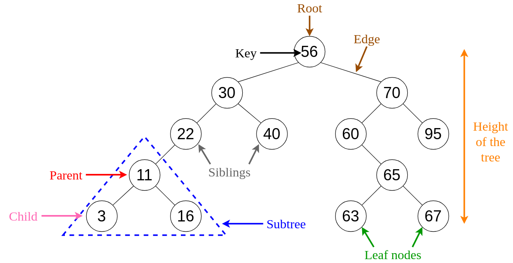

# Tree



## Introduction

Think of your family tree where the root is your ancestor and the children are their descendants. In computer science,
this kind of structure is useful for representing a hierarchical data, such as in your computer's file system. Computer
scientists call it a 'tree' because it resembles an inverted tree, with 'nodes' representing a piece of information,
and the connections between nodes (or 'edges') representing the relationships. Trees find applications in various
fields, and today we will focus on the Binary Search Tree. Let's take a look at its structure a bit more in depth.

## Structure

### Node

At the core of a tree is the `node`. Think of a node as a person in the family tree analogy. Nodes are points in the
tree which hold some information. Each node may have zero or more 'children,' forming 'branches.'

- #### Left Child
     A reference to the child node on the left branch, if it exists.

- #### Right Child
    A reference to the child node on the right branch, if it exists.

### Root

The `root` is the topmost node of the tree, serving as the starting point for traversing the structure. Think of the
ancestor in the family tree analogy. Being at the uppermost part of the tree, the `root` has no parent nodes.

## Importance of Balancing

Balancing a tree means adjusting the structure of a tree so that the height is minimized. The height of a tree is the
length of the longest path from the root to any node that doesn't have any children nodes. A balanced tree can improve
the efficiency of operations because it reduces the number of nodes that need to be visited or compared. This ensures
that the structure remains efficient.

A tree is generally considered 'balanced' when the height difference between the highest and lowest leaf nodes (nodes
that don't have any child nodes) is less than 2.

For example:
- Balanced Tree:
  ```text
        4
       / \
      3   7
     /   / \
    2   5   8    ─┐
   /     \        │ - 1
  1       6      ─┘
  
  Total Height = 4; Distance between lowest and highest leaf = 1
  ```

- Unbalanced Tree:
  ```text
      3
     / \
    2   4
   /     \
  1       5          ─┐
           \          │
            6        ─┤
             \        │ - 3
              7      ─┤
               \      │
                8    ─┘
  
  Total Height = 6; Distance between lowest and highest leaf = 3
  ```

## Recursion

Recursion is a technique where a function calls itself to solve a smaller sub-problem of the original problem.
Recursion can be seen in many natural phenomena, such as fractals, Fibonacci sequence, and tree structures. Recursion
is useful for data structures, especially binary search trees, because it simplifies the code and reduces the need for
loops and variables.

## Operations

### Insertion

Adding a new node to the tree. To insert a node in a BST (Binary Search Tree), we can compare the value with the root
node. If the value is less than or equal to the root, we can recursively insert it in the left subtree. If the value
is greater than the root, we can recursively insert it in the right subtree. If the root is null, we can create a new
node with the value and return it as the root.

### Deletion

Removing a node from the tree. To delete a value in a BST, we can compare the value with the root node. If the value is
less than the root, we can recursively delete it from the left subtree.

If the value is greater than the root, we can recursively delete it from the right subtree.

If the value is equal to the root, we have three cases to consider:

  - **The root has no children:** We can simply delete the root and return null as the new root.
  - **The root has one child:** We can delete the root and return its child as the new root.
  - **The root has two children:** We can find the minimum value in the right subtree, replace the root’s value with it, 
    and recursively delete the minimum value from the right subtree.

### Search (or `Contains()`)

Locating a specific node with a given value in the tree. To search for a value in a BST, we can compare the value with
the root node. If they are equal, we have found the value. If the value is less than the root, we can recursively
search in the left subtree. If the value is greater than the root, we can recursively search in the right subtree.

## Efficiency of Common Operations

The efficiency of common operations on a tree depends on the height of the tree. The height of a tree determines the
maximum number of nodes that need to be visited or compared in the worst case. The lower the height, the higher the
efficiency, thus the importance of balancing. The height of a tree can vary from O(log n) to O(n), where n is the
number of nodes in the tree. A balanced tree has a height of O(log n), which means that the common operations can be
performed in O(log n) time. An unbalanced tree can have a height of O(n), which means that the common operations can
take O(n) time.

## Benefits/Uses

- **Hierarchical Representation:** Trees are excellent for representing hierarchical structures, such as file systems
or organization charts. Once again, think of how we represent families; because families are hierarchical, the tree was
naturally the best solution for how to represent it.
  
- **Efficient Searching:** Balanced trees enable efficient searching, making them suitable for applications like
databases and symbol tables.

## Implementation in C#

Since C# doesn't have a built-in object for a Binary Search Tree, we can implement it ourselves.

This is what a tree node might look like. Notice the use of recursion for the `Insert()` method:

```csharp
public class Node {
    public int Data { get; set; }
    public Node? Right { get; private set; }
    public Node? Left { get; private set; }

    public Node(int data) {
        this.Data = data;
    }

    public void Insert(int value) {
        if (value < Data) {
            if (Left is null)
                Left = new Node(value);
            else
                Left.Insert(value);
        }
        else if (value > Data) {
            if (Right is null)
                Right = new Node(value);
            else
                Right.Insert(value);
        }
    }

    public bool Contains(int value) {
        if (Data == value)
            return true;
        
        return (Left?.Contains(value) ?? false) || (Right?.Contains(value) ?? false);
    }

    public int GetHeight()
    {
        int heightLeft = Left?.GetHeight() ?? 0;
        int heightRight = Right?.GetHeight() ?? 0;
        
        return 1 + Math.Max(heightLeft, heightRight);
    }
}
```

And here's how we can use those nodes for our implementation of the BST:

```csharp
public class BinarySearchTree : IEnumerable<int> {
    private Node? _root;

    public void Insert(int value) {
        Node newNode = new Node(value);
        if (_root is null)
            _root = newNode;
        else
            _root.Insert(value);
    }

    public bool Contains(int value) {
        return _root != null && _root.Contains(value);
    }

    IEnumerator IEnumerable.GetEnumerator() {
        return GetEnumerator();
    }

    public IEnumerator<int> GetEnumerator() {
        var numbers = new List<int>();
        TraverseForward(_root, numbers);
        foreach (var number in numbers) {
            yield return number;
        }
    }

    private void TraverseForward(Node? node, List<int> values) {
        if (node is not null) {
            TraverseForward(node.Left, values);
            values.Add(node.Data);
            TraverseForward(node.Right, values);
        }
    }
    
    public IEnumerable Reverse() {
        var numbers = new List<int>();
        TraverseBackward(_root, numbers);
        foreach (var number in numbers) {
            yield return number;
        }
    }

    private void TraverseBackward(Node? node, List<int> values)
    {
        if (node is null) return;
        TraverseBackward(node.Right, values);
        values.Add(node.Data);
        TraverseBackward(node.Left, values);
    }

    public int GetHeight() {
        if (_root is null)
            return 0;
        return _root.GetHeight();
    }

    public override string ToString() {
        return "<Bst>{" + string.Join(", ", this) + "}";
    }
}
```

## Example

Create a BST from an array of values.

> **Remember the importance of balancing!** If we merely go through each value of the array in order adding them to the
> BST sequentially, we'll get a structure that looks something like this:
> 
> ```text
> [A, B, C, D, E, F, G] => A
>                           \
>                            B
>                             \
>                              C
>                               \
>                                D
>                                 \
>                                  E
>                                   \
>                                    F
>                                     \
>                                      G
> ```
> 
> Using this method, we get something that looks more like a line rather than a tree. What we really want is something
> that looks like this:
> 
> ```text
> [A, B, C, D, E, F, G] =>   D
>                          /   \
>                         B     F
>                        / \   / \
>                       A   C E   G
> ```
> 
> Now that looks like a tree! Notice how the root node came from the middle of the array. This should give a hint as to
> how we can create a balanced BST.

```csharp
// Public method to create a balanced BST from a sorted array
internal static BinarySearchTree CreateBalancedBst(int[] arr)
{
    // Make sure arr is sorted
    Array.Sort(arr);
    
    // Create new BST
    var bst = new BinarySearchTree
    {
        // Call the private recursive method
        Root = CreateBalancedBst(arr, 0, arr.Length - 1)
    };

    // Return the now full BST
    return bst;
}

// Private recursive method to create a balanced BST from a sorted array
private static Node? CreateBalancedBst(int[] arr, int start, int end)
{
    // Base case: if the start index is greater than the end index, return null
    if (start > end)
    {
        return null;
    }

    // Find the middle index of the subarray
    int mid = (start + end) / 2;

    // Create a new node with the middle element and insert it as the root
    var node = new Node(arr[mid]);
    node.Insert(arr[mid]);

    // Recursively create the left and right subtrees with the left and right sub-arrays
    node.Left = CreateBalancedBst(arr, start, mid - 1);
    node.Right = CreateBalancedBst(arr, mid + 1, end);

    // Return the node
    return node;
}
```

Output:
```text
Array: 1, 2, 3, 4, 5
BST: <Bst>{1, 2, 3, 4, 5}
Array: 38, 57, 29, 5, 28, 4
BST: <Bst>{4, 5, 28, 29, 38, 57}
```

Note that the original array has to be sorted in order for us to be able to start from the middle value.

## Problem to Solve

Given a tree with some nodes, write a function in C# to check whether the tree is balanced or not. A balanced tree
ensures that the depth of the left and right subtrees of every node differ by no more than one.

For example:
- Balanced Tree:
  ```text
      A
     / \
    B   C
   / \
  D   E
  ```

- Unbalanced Tree:
  ```text
    A
   / \
  B   C
       \
        D
         \
          E
  ```

Test your code by running Main in [ds3-problem](./ds3-problem/Program.cs)

You can check your code with the solution here: [Solution](./ds3-solution/Program.cs)

{[Previous - Linked List](./2-linkedList.md)}

[Back to Welcome Page](./0-welcome.md)